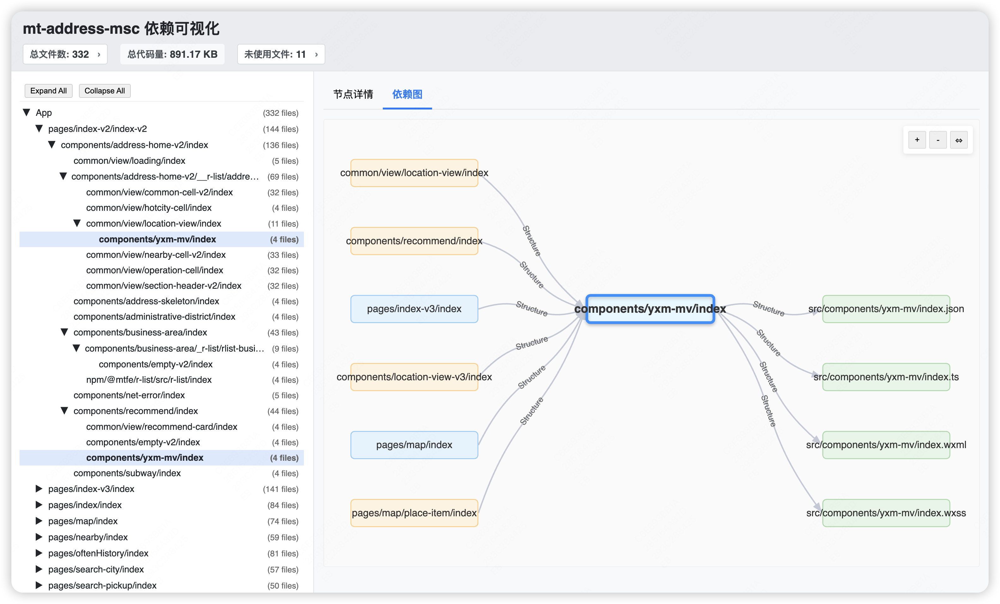

[](https://www.npmjs.org/package/mp-lens)
[](https://github.com/chess99/mp-lens/blob/master/LICENSE)
[](https://www.npmjs.org/package/mp-lens)

**`mp-lens` 是一款专为微信小程序开发者设计的命令行工具，基于依赖分析，一键发现并清理未使用的文件与代码，帮助您安全瘦身并优化项目。**

它聚焦清理相关场景：快速清理冗余、精准优化包体积，并辅助理解项目结构与提升代码质量。

通过一条命令立即体验清理（默认仅预览，实际删除前会有确认提示，可放心试用）：

```bash
npx mp-lens clean
```

---

## ✨ 功能特性

- **全面的依赖分析:** 为安全清理提供可靠依据；扫描多种文件类型（`.js`, `.ts`, `.wxml`, `.wxss`, `.less`,`.json`,`.wxs`, 及常见图片格式），构建项目依赖图。
- **依赖图可视化:** 生成交互式 HTML 或 JSON 格式的依赖图，清晰展现页面、组件、脚本间的相互联系。
- **精准的未使用文件检测:** 基于依赖分析，准确识别项目中未被任何地方引用的孤立文件。
- **灵活的路径别名支持:** 智能解析 TypeScript 路径别名 (Path Aliases) 和自定义别名配置。
- **广泛的项目结构兼容:** 支持自定义小程序项目根目录、`miniappRoot` 和入口文件路径。
- **安全至上的清理机制:**
  - 默认在删除文件前进行**交互式确认**。
  - 支持 Glob 模式，可在分析和清理时**排除**特定文件或目录。
- **代码质量检查（辅助清理）:**
  - 检查组件声明与使用的一致性 (`lint` 命令)。
  - 清理 WXSS 文件中未使用的 CSS 规则 (`purgewxss` 命令)。
  - 检测重复代码 (`cpd` 命令)。
- **包体差异分析（清理前后对比）:** 对比两个 Git 提交（分支或标签）之间的包体构成和大小差异 (`diff` 命令)。

## 安装（可选）

如需本地安装以获得更快的执行体验：

```bash
npm install --save-dev mp-lens
# 或者
yarn add --dev mp-lens
```

## 📖 命令详解

基本命令结构与示例：

```bash
mp-lens [全局选项] <命令> [命令特定选项]
```

将 `<命令>` 替换为以下之一：`clean`, `graph`, `lint`, `purgewxss`, `diff`, `cpd`。

```bash
mp-lens clean --write
```

### 全局选项

这些选项适用于所有命令：

- `-p, --project <路径>`: 指定项目的根目录 (默认: 当前执行命令的目录)。
- `--miniapp-root <路径>`: 指定小程序代码所在的子目录（相对于项目根目录）。如果未指定，工具会尝试自动检测（如 `src`, `miniprogram`）。
- `--entry-file <路径>`: 指定入口文件路径（相对于 `miniappRoot`，默认为 `app.json`）。
- `--config <路径>`: 指定配置文件的路径。
- `--exclude <Glob模式>`: 用于排除文件/目录的 Glob 模式。可多次使用此选项。
- `--essential-files <文件1,...>`: 指定应被视为"必要"的文件路径（相对于 `miniappRoot`），这些文件不会被报告为未使用。
- `--include-assets`: 在分析和清理中包含图片等资源文件 (默认不包含)。
- `-v, --verbose`: 显示更详细的日志输出，有助于调试。
- `-h, --help`: 显示帮助信息。

### `clean` - 分析并移除未使用的文件

**⚠️ 警告：此命令会修改或删除您的文件，请务必谨慎操作！**

**用法示例:**

```bash
# 预览模式: 分析并列出未使用文件，然后提示确认删除
mp-lens clean

# 写入模式: 实际删除文件
mp-lens clean --write

# 清理时排除特定目录
mp-lens --exclude "**/legacy/**" clean
```

**选项:**

- `--write`: 实际写入更改（删除文件），不进行确认提示。

### `graph` - 生成依赖关系图

**用法示例:**

```bash
# 生成交互式 HTML 依赖图
mp-lens graph

# 生成 JSON 格式的依赖图数据
mp-lens graph -f json -o dependency-data.json
```

**选项:**

- `-f, --format <format>`: 输出格式 (html|json)。默认为 `html`。
- `-o, --output <file>`: 保存图文件的路径。



### `lint` - 检查组件声明与使用的一致性

分析 `.json` 声明与 `.wxml` 中的实际使用情况是否匹配。

```bash
# 分析整个小程序项目的组件使用情况
mp-lens lint

# 分析并尝试自动修复 JSON 文件中"声明但未使用"的组件
mp-lens lint --fix
```

**选项:**

- `[path]` (可选): 指定要分析的具体文件或目录。
- `--fix`: 自动从 `.json` 文件中移除"声明但未使用"的组件条目。

### `purgewxss` - 清理 WXSS 文件中未使用的 CSS 规则

**⚠️ 警告：此命令可能移除有用的 CSS，特别是在涉及复杂动态类名时。请务必仔细检查更改。**

```bash
# 预览将移除的 CSS (不实际写入文件)
mp-lens purgewxss

# 实际写入更改 (谨慎使用!)
mp-lens purgewxss --write
```

**选项:**

- `[wxss-file-path]` (可选): 指定要分析的具体 WXSS 文件。
- `--write`: **(高风险)** 实际将优化后的 CSS 写入 `.wxss` 文件。

### `diff` - 对比不同版本间的包体差异

分析并对比两个 Git 提交（分支或标签）之间的小程序包体构成和大小差异。

```bash
# 对比当前分支与 master 分支的包体差异
mp-lens diff --base master --target HEAD
```

**选项:**

- `--base <分支/提交>`: 指定对比的基准版本 (默认: `master`)。
- `--target <分支/提交>`: 指定对比的目标版本 (默认: `HEAD`)。

### `cpd` - 代码重复检测 (Copy-Paste Detection)

检测项目中的重复或高度相似的代码片段。

```bash
# 在整个项目中执行代码重复检测
mp-lens cpd
```

## ⚙️ 配置文件

对于复杂或固定的配置，建议在项目根目录创建 `mp-lens.config.js`。

```javascript
// mp-lens.config.js
module.exports = {
  miniappRoot: 'src',
  exclude: ['**/node_modules/**', '**/*.mock.js'],
  essentialFiles: ['utils/init.js'],
  aliases: {
    '@/*': ['src/*'],
  },
};
```

更多配置项请参考[示例文件](docs/examples/mp-lens.config.js)。

## 🤝 与 Knip 集成 (可选)

`mp-lens` 可与 [Knip](https://knip.dev) 集成，以实现更深层次的代码分析。两者结合能提供更全面的项目清理方案。参考示例配置 `docs/examples/knip.js`，并查看[集成文档](docs/knip-integration.md)。

## 🤝 贡献

我们非常欢迎各种形式的贡献！如果您发现任何问题、有功能建议或希望改进代码，请随时提交 [Issue](https://github.com/chess99/mp-lens/issues) 或创建 [Pull Request](https://github.com/chess99/mp-lens/pulls)。

## 📄 许可证

本项目采用 MIT 许可证。详情请参阅 [LICENSE](LICENSE) 文件。
