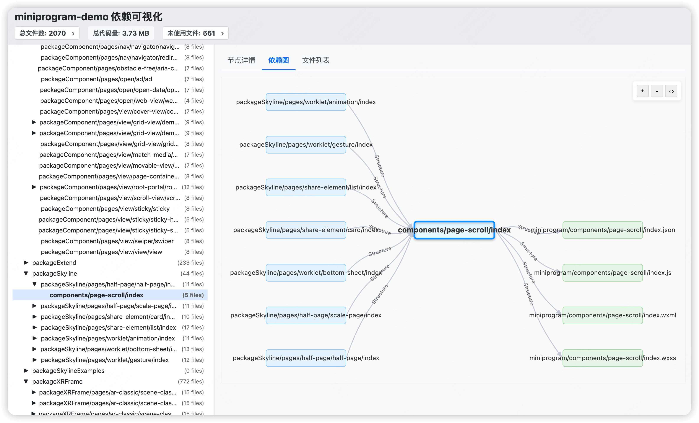

# mp-lens (小程序分析工具)

[](https://www.npmjs.org/package/mp-lens)
[](https://github.com/chess99/mp-lens/blob/master/LICENSE)
[](https://www.npmjs.org/package/mp-lens)
[](https://travis-ci.com/chess99/mp-lens) <!-- CI/CD占位符 -->

**mp-lens** 是一个命令行工具，旨在帮助微信小程序开发者理解项目结构、可视化依赖关系、分析包大小并安全地移除未使用的文件。

是否厌倦了臃肿的项目体积，以及手动寻找未使用的组件、页面、图片或工具函数的繁琐过程？ `mp-lens` 会扫描你的项目，构建依赖图，并找出可以安全移除的孤立文件。

## ✨ 功能特性

* **全面的依赖分析:** 扫描多种文件类型（`.js`, `.ts`, `.wxml`, `.wxss`, `.json`, `.wxs`, 以及常见的图片格式），构建项目依赖图。
* **依赖图可视化:** 生成交互式 HTML 或静态图文件（如 DOT 语言、SVG、PNG），助你清晰理解页面、组件、脚本之间的相互联系。
* **未使用的文件检测:** 根据分析结果，识别出项目中未被任何地方引用的文件（包括页面、组件、脚本、样式、图片、WXS模块等）。
* **路径别名支持:** 支持解析 TypeScript 路径别名 (Path Aliases) 和自定义别名配置，正确分析使用别名导入的模块依赖关系。
* **灵活的项目结构支持:** 支持自定义小程序项目路径和入口文件路径，适用于不同目录结构的项目。也支持自动检测 `app.json`。
* **安全清理:**
  * 提供 `--list` 模式，预览哪些文件*将*被删除，但并**不执行**实际删除操作。
  * 默认在删除文件前进行**交互式确认**。
  * 支持 Glob 模式，可在分析和清理时**排除**特定的文件或目录。
* **可配置:** 可通过命令行选项快速执行任务，也支持通过配置文件进行更复杂的设置。
* **使用 TypeScript 构建:** 类型安全，易于维护。

## 🚀 安装

你可以全局安装 `mp-lens`，或将其作为项目的开发依赖项。

**全局安装:**

```bash
npm install -g mp-lens
# 或者
yarn global add mp-lens
```

**本地安装 (推荐用于项目):**

```bash
npm install --save-dev mp-lens
# 或者
yarn add --dev mp-lens
```

如果本地安装，通常通过 `npx` 运行：`npx mp-lens <命令>`，或者将其添加到 `package.json` 的 `scripts` 中。

## 💡 使用方法

基本命令结构如下：

```bash
mp-lens [全局选项] <命令> [命令选项]
```

如果本地安装且未使用 `npx`，请使用相对路径运行，例如：`./node_modules/.bin/mp-lens`。

**全局选项:**

* `-p, --project <路径>`: 指定项目的根目录 (默认: 当前目录)。
* `-h, --help`: 显示帮助信息。
* `-v, --verbose`: 显示更详细的日志输出。
* `--config <路径>`: 指定配置文件的路径 (可选高级功能)。
* `--miniapp-root <路径>`: 指定小程序代码所在的子目录（相对于项目根目录，可自动检测）。
* `--entry-file <路径>`: 指定入口文件路径（相对于小程序根目录，默认为app.json，可自动检测）。

**可用命令:**

### `graph`

生成依赖关系图的可视化文件。

```bash
# 在当前目录生成一个交互式的 HTML 依赖图
mp-lens graph

# 为指定项目生成 SVG 格式的依赖图并保存
mp-lens -p ../我的小程序 graph -f svg -o dependency-graph.svg

# 生成聚焦于特定页面的依赖图
mp-lens graph --focus src/pages/home/index.js -o home-deps.html
```

**选项:**

* `-f, --format <html|dot|json|png|svg>`: 输出格式 (默认: html)。生成 PNG/SVG 可能需要系统安装 Graphviz。
* `-o, --output <文件>`: 保存图文件的路径。
* `--depth <数字>`: 限制依赖图的显示深度。
* `--focus <文件路径>`: 高亮显示与特定文件相关的依赖。
* `--npm`: 在图中包含 `node_modules` 或 `miniprogram_npm` 中的依赖 (默认: true)。



### `clean`

分析项目并删除未使用的文件。**⚠️ 使用此命令务必谨慎！**

**默认行为:**

* 分析项目，找出未使用的文件。
* 列出将被删除的文件。
* **提示用户确认**是否继续删除。

**安全提示:**

1. **使用版本控制 (如 Git)** 并在运行 `clean` 前提交所有更改。
2. 首次使用时，考虑先用 `--list` 模式查看将删除哪些文件。

**用法示例:**

```bash
# 默认模式: 列出文件并提示确认删除
mp-lens clean

# 列表模式: 只列出将被删除的文件 (安全，不执行任何操作)
mp-lens clean --list

# 删除模式: 直接删除未使用文件，不进行确认 (谨慎使用!)
mp-lens clean --delete

# 仅清理未使用的图片文件 (会提示确认)
mp-lens clean --types png,jpg,gif

# 清理时排除特定的目录 (会提示确认)
mp-lens clean --exclude "**/legacy/**"

# 直接删除未使用的 JS 和 WXML 文件 (谨慎使用!)
mp-lens clean --delete --types js,wxml
```

**选项:**

* `--types <类型1,类型2,...>`: 指定要分析和删除的文件类型，用逗号分隔 (默认: js,ts,wxml,wxss,json,png,jpg,jpeg,gif,svg,wxs)。
* `--exclude <模式>`: 用于排除文件/目录的 Glob 模式。可多次使用。
* `--essential-files <文件1,文件2,...>`: 指定应被视为必要的文件（这些文件永远不会被删除），用逗号分隔。
* `--list`: **(推荐)** 只列出将被删除的文件，不实际执行任何操作。
* `--delete`: **(谨慎使用)** 跳过交互式确认步骤，直接删除文件。

### `lint`  

分析小程序项目中自定义组件的声明与 WXML 中的实际使用情况是否一致。可以帮助发现以下问题：

* 组件在 `.json` 文件中声明，但在对应的 `.wxml` 文件中并未使用 (“声明但未使用”)。
* 标签在 `.wxml` 文件中被使用，看起来像自定义组件，但未在对应的 `.json` 文件中声明 (“使用但未声明”)。

```bash
# 分析整个小程序项目的组件使用情况
mp-lens lint

# 分析指定页面或组件的组件使用情况
mp-lens lint src/pages/my-page/index

# 分析并自动修复 JSON 文件中“声明但未使用”的组件
mp-lens lint --fix
```

**选项:**

* `[path]` (可选): 指定要分析的具体文件（`.wxml` 或 `.json`）或目录路径。如果指定了文件，其对应的 `.wxml` 或 `.json` 会被自动包含。如果省略，则分析整个小程序项目。
* `--fix`: 自动修复 `.json` 文件中“声明但未使用”的问题。此选项会修改你的源文件，请谨慎使用，建议在版本控制下操作。

**注意:** `lint` 命令目前主要关注组件声明和使用的匹配关系，它**不会**修改 WXML 文件。

## 与Knip集成检测未使用的文件和组件

mp-lens 提供了与 [Knip](https://knip.dev) 的集成支持，帮助你检测小程序项目中未使用的文件、组件和死代码。

与mp-lens的文件级别分析不同，Knip能深入分析模块内部，找出未使用的导出（exports）、函数和变量，从而实现更加精细的代码清理。

```bash
# 安装依赖
npm install --save-dev mp-lens knip
```

详细的集成指南和配置示例请查看 [mp-lens与Knip集成文档](docs/knip-integration.md)。

## ⚙️ Configuration File

对于复杂的配置（例如，大量的排除规则、路径别名等），可以使用配置文件 `mp-lens.config.json` 或 `mp-lens.config.js` 放置于项目根目录，或通过全局选项 `--config` 指定路径。

配置文件示例 (`mp-lens.config.json`):

```json
{
  "miniappRoot": "src",
  "entryFile": "app.json",
  "types": "js,ts,wxml,wxss,json,png,jpg,jpeg,gif,svg",
  "exclude": [
    "**/node_modules/**",
    "**/miniprogram_npm/**",
    "**/*.mock.js"
  ],
  "essentialFiles": [
    "utils/init.js", // 这个文件总是被认为是必需的
    "config/theme.json"
  ],
  "includeAssets": false // 默认不清理图片等资源文件
}
```

**常用配置项说明:**

* `miniappRoot`: (字符串) 小程序源代码所在的子目录（相对于项目根目录）。
* `entryFile`: (字符串) 入口文件的路径（相对于 `miniappRoot`）。默认为 `app.json`。
* `types`: (字符串) 要分析的文件扩展名列表，用逗号分隔。
* `excludePatterns` 或 `exclude`: (字符串数组) 要排除的文件/目录的 Glob 模式列表。
* `essentialFiles`: (字符串数组) 应始终被视为必需的文件路径列表（相对于 `miniappRoot`），这些文件永远不会被报告为未使用或被清理。
* `includeAssets`: (布尔值) 是否在清理和报告中包含图片等资源文件(.png, .jpg, .jpeg, .gif, .svg)。默认为 false，表示这些资源文件不会被报告为未使用或被清理。设置为 true 表示显式包含这些资源文件在分析和清理范围内。
* `aliases`: (对象) 路径别名配置，用于解析模块导入（通常从 `tsconfig.json` 或 `jsconfig.json` 自动加载）。

## 🤝 贡献

欢迎各种形式的贡献！如果你发现任何问题或有改进建议，请随时提交 Issue 或 Pull Request。

## 📄 许可证

本项目采用 MIT 许可证。详情请参阅 [LICENSE](LICENSE) 文件。
